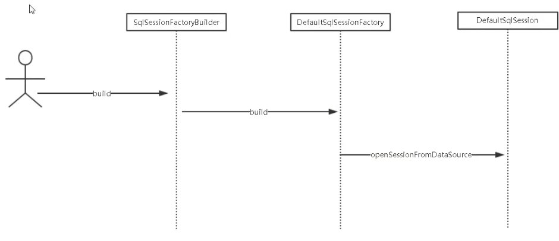

# Mybatis详解

## 官方文档

| 文档说明       | 相关URL                                                     |
| -------------- | ----------------------------------------------------------- |
| 官方说明文档   | https://mybatis.org/mybatis-3/zh/index.html                 |
| 逆向工程       | https://mybatis.org/generator/running/runningWithMaven.html |
| Mybatis-Spring | http://mybatis.org/spring/zh/index.html                     |
| 源码工程       | https://github.com/mybatis/mybatis-3                        |
| 源码注释工程   | https://github.com/tuguangquan/mybatis                      |

[mybatis学习脑图](./mybatis.xmind)

## 传统 JDBC

### JDBC介绍

JDBC操作数据库的基本步骤：

#### 1、加载JDBC驱动程序。

在连接数据库之前，首先要加载想要连接的数据库的驱动到JVM（Java虚拟机）， 这通过java.lang.Class类的静态方法forName(String className)实现。成功加载后，会将Driver类的实例注册到DriverManager类中。

#### 2、提供JDBC连接的URL。

连接URL定义了连接数据库时的协议、子协议、数据源标识。

书写形式：协议：子协议：数据源标识。

#### 3、创建数据库的连接。

要连接数据库，需要向java.sql.DriverManager请求并获得Connection对象， 该对象就代表一个数据库的连接。

使用DriverManager的getConnectin(String url , String username , String password )方法传入指定的欲连接的数据库的路径、数据库的用户名和 密码来获得。

#### 4、创建一个Statement，要执行SQL语句，必须获得java.sql.Statement实例。

Statement实例分为以下3 种类型：

（1）执行静态SQL语句。通常通过Statement实例实现。

（2）执行动态SQL语句。通常通过PreparedStatement实例实现。

（3）执行数据库存储过程。通常通过CallableStatement实例实现。

#### 5、执行SQL语句。

Statement接口提供了三种执行SQL语句的方法：executeQuery 、executeUpdate 和execute

#### 6、处理两种情况的结果。

（1）执行更新返回的是本次操作影响到的记录数。

（2）执行查询返回的结果是一个ResultSet对象。

ResultSet包含符合SQL语句中条件的所有行，并且它通过一套get方法提供了对这些 行中数据的访问。

使用结果集（ResultSet）对象的访问方法获取数据。

#### 7、关闭JDBC对象（关闭结果集-->关闭数据库操作对象-->关闭连接）。

操作完成以后要把所有使用的JDBC对象全都关闭，以释放JDBC资源，关闭顺序和声 明顺序相反：

（1）关闭记录集。

（2）关闭声明。

（3）关闭连接对象。

```

```

### JDBC扩展资料：

#### 一、JDBC（Java DataBase Connectivity,java数据库连接）

是一种用于执行SQL语句的Java API，可以为多种关系数据库提供统一访问，它由一组用Java语言编写的类和接口组成。JDBC提供了一种基准，据此可以构建更高级的工具和接口，使数据库开发人员能够编写数据库应用程序，同时，JDBC也是个商标名。

#### 二、特性

Java 具有坚固、安全、易于使用、易于理解和可从网络上自动下载等特性，是编写数据库应用程序的杰出语言。所需要的只是 Java应用程序与各种不同数据库之间进行对话的方法。而 JDBC 正是作为此种用途的机制。

#### 三、用途

简单地说，JDBC 可做三件事：与数据库建立连接、发送 操作数据库的语句并处理结果。

### 传统 JDBC 的弊端：

1、jdbc 底层没有用连接池、操作数据库需要频繁的创建和关联链接。消耗很大的资源
2、写原生的 jdbc 代码在 java 中，一旦我们要修改 sql 的话，java 需要整体编译，不利于系统维护
3、使用 PreparedStatement 预编译的话对变量进行设置 123 数字，这样的序号不利于维护
4、返回 result 结果集也需要硬编码。

## Mybatis 核心概念

Configuration、SqlSessionFactory、Session、Executor、MappedStatement、StatementHandler、ResultSetHandler

| 名称              | 意义                                                         |
| ----------------- | ------------------------------------------------------------ |
| Configuration     | 管理 mysql-config.xml 全局配置关系类                         |
| SqlSessionFactory | Session 管理工厂接口                                         |
| Session           | SqlSession是一个面向用户（程序员）的接口。<br/>SqlSession 中提供了很多操作数据库的方法 |
| Executor          | 执行器是一个接口（基本执行器、缓存执行器）<br/>作用：SqlSession 内部通过执行器操作数据库 |
| MappedStatement   | 底层封装对象<br/>作用：对操作数据库存储封装，包括 sql 语句、输入输出参数 |
| StatementHandler  | 具体操作数据库相关的 handler 接口                            |
| ResultSetHandler  | 具体操作数据库返回结果的 handler 接口                        |

#### Configuration


```java
    // 此方法 com.nuoya.mybatis.mapper.UserMapper 类不存在也可以
    @Test
    public void test1(){
        try {
            String resource = "mybatis-config.xml";
            InputStream inputStream = Resources.getResourceAsStream(resource);
            SqlSessionFactory sqlSessionFactory = new SqlSessionFactoryBuilder().build(inputStream);
            SqlSession session = sqlSessionFactory.openSession();
            User user = session.selectOne("com.nuoya.mybatis.mapper.UserMapper.selectUser", 1);
            System.out.println(user);
        } catch (IOException e) {
            e.printStackTrace();
        }
    }
```

源码解析：


SqlSessionFactory sqlSessionFactory = new SqlSessionFactoryBuilder().build(inputStream);


SqlSession session = sqlSessionFactory.openSession();




User user = session.selectOne("com.nuoya.mybatis.mapper.UserMapper.selectUser", 1);


mybatis获取mapper

mybatis之SQL


mybatis之Executor


```java
SimpleExecutor 实际是不干活的
干活的类：
org.apache.ibatis.executor.statement.StatementHandler
org.apache.ibatis.executor.statement.PreparedStatementHandler
org.apache.ibatis.executor.resultset.ResultSetHandler
org.apache.ibatis.executor.resultset.DefaultResultSetHandler
```


Mybatis的缓存

Mybatis的一级缓存默认开启，影响范围为session

二级缓存作用域全局


注意缓存击穿问题


## Mybatis 逆向工程：

### 什么是逆向工程:

MyBatis 的一个主要的特点就是需要程序员自己编写 sql，那么如果表太多的话，难免会很麻烦，所以 mybatis 官方提供了一个逆向工程，可以针对单表自动生成 mybatis 执行所需要的代码（包括 mapper.xml、mapper.java、po..）。一般在开发中，常用的逆向工程方式是通过数据库的表生成代码

### 具体操作

#### 引入jar

```xml
<plugin>
 <groupId>org.mybatis.generator</groupId>
 <artifactId>mybatis-generator-maven-plugin</artifactId>
 <version>1.3.7</version>
 <dependencies>
 <dependency>
 <groupId>mysql</groupId>
 <artifactId>mysql-connector-java</artifactId>
 <version>${mysql-connector-java.version}</version>
 </dependency>
 </dependencies>
</plugin>
```

#### 2.配置 mybatis-genrtator.xml 

#### 3.mybatis-generator:generate 

XMLMAPPER|ANNOTATEDMAPPER

去掉注释：

```xml
<!--注释去掉-->
<commentGenerator >
    <property name="suppressAllComments" value="true"/>
</commentGenerator>
```

## 通用mapper&mybatis-plus


## 常见问题

### Mybatis 之注解和 xml 优缺点:

Xml：增加 xml 文件、麻烦、条件不确定、容易出错，特殊字符转义
注释：不适合复杂 sql，收集 sql 不方便，重新编译

### Mybatis 之${}与#{}区别：

参数标记符号

#{}预编译，防止 sql 注入(推荐) 。常用于用户传参

${}可以 sql 注入，代替作用。常用用于程序内部传参

### Mybatis 之 parameterType 与 parameterMap 区别：

通过 parameterType 指定输入参数的类型，类型可以是简单类型、hashmap、pojo 的包装
类型

### Mybatis 之 resultType 与 resultMap 区别：

使用 resultType 进行输出映射，只有查询出来的列名和 pojo 中的属性名一致，该列才可以
映射成功。
mybatis 中使用 resultMap 完成高级输出结果映射。

### Mybatis 之 plugin：

com.jiagouedu.mybatis.plugin.SqlPrintInterceptor

### 执行SQL中包含SQL关键字

使用``包裹字段

